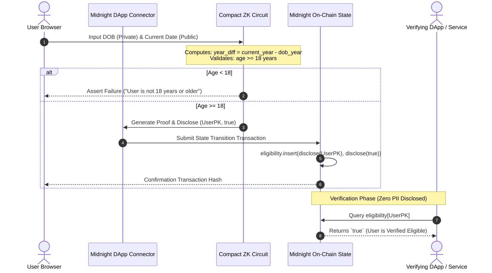

# MidnightPass — Private Age & Eligibility Gate

[](https://github.com/payalbabar/fullmoonlevel3/actions/workflows/ci.yml)


> **Selective Disclosure in Action:** Prove you meet the legal age requirement (18+) without ever exposing your exact date of birth, age, or identity to the ledger or third parties.

---

## 📌 Executive Overview

**MidnightPass** is a privacy-preserving age and eligibility gate built natively on the **Midnight Network**. 

Web3 applications (DeFi protocols, gaming platforms, compliance-restricted token launches) and Web2 services require age verification to satisfy regulatory standards. Traditional solutions expose sensitive personal identifiable information (PII)—such as raw birth dates or passport scans—on transparent public blockchains or centralized servers.

MidnightPass solves this paradigm using Midnight's **hybrid privacy model**:
1. **Local ZK Witnesses:** The user's date of birth remains strictly local on their personal device.
2. **In-Browser Circuit Execution:** Age calculation logic (`current_date - dob >= 18`) is verified inside a zero-knowledge proof generated locally.
3. **Selective Disclosure:** Only the user's public key address and a boolean `true` eligibility flag are recorded on the public ledger map (`eligibility`).

---

## 🏗️ System Architecture & Data Flow

### 1. High-Level Architecture Diagram

```mermaid
graph TD
    subgraph Client ["Client Device (Browser Sandbox)"]
        User[User Input: DOB] -->|Private Witness| Witness[Secret Witnesses: year, month, day]
        Witness --> Circuit[Compact ZK Circuit: prove_eligibility]
        CurrentDate[Public Params: current date] --> Circuit
        UserPK[User Public Key / Address] --> Circuit
        
        Circuit -->|Generate Local ZK Proof| ZKProof[Zero-Knowledge Proof + Disclosed State]
    end

    subgraph Wallet ["Browser Extension (Lace / 1AM Wallet)"]
        ZKProof --> DAppSDK[@midnight-ntwrk/dapp-connector-api]
        DAppSDK --> TxBuilder[Balance & Sign Transaction]
    end

    subgraph MidnightNet ["Midnight Network (Preprod Ledger)"]
        TxBuilder -->|Submit Tx| Node[Preprod Validator Node]
        Node -->|Update Public Map State| LedgerMap["Map<Bytes<32>, Boolean> (eligibility)"]
    end

    subgraph ThirdParty ["Third-Party DApp Integration"]
        ThirdPartyDApp[Target DApp / DeFi Protocol] -->|Query Ledger Map| LedgerMap
        LedgerMap -->|Returns true / false| ThirdPartyDApp
    end
```

---

### 2. Sequence Diagram: Verification & Ledger Update Flow



---

## 📜 Smart Contract Architecture (`contracts/eligibility.compact`)

The core circuit logic is implemented in **Compact v0.23** (`compactc` version `0.31.1`).

### State & Witness Specifications

```compact
pragma language_version 0.23;

import CompactStandardLibrary;

// Ledger state mapping a public key/address to their verified eligibility status
export ledger eligibility: Map<Bytes<32>, Boolean>;

// Witnesses supplying the private date of birth off-chain
witness secret_dob_year(): Uint<32>;
witness secret_dob_month(): Uint<32>;
witness secret_dob_day(): Uint<32>;

// Witness supplying the user's public key
witness user_public_key(): Bytes<32>;
```

### ZK Circuit Logic & Assertions

```compact
export circuit prove_eligibility(
    current_year: Uint<32>,
    current_month: Uint<32>,
    current_day: Uint<32>
): Boolean {
    const dob_year = secret_dob_year();
    const dob_month = secret_dob_month();
    const dob_day = secret_dob_day();

    // Verify age condition: current_date - dob >= 18 years
    const year_diff = current_year - dob_year;
    
    const is_older = year_diff > 18;
    const is_exact = year_diff == 18;
    
    const month_ok = current_month > dob_month;
    const month_equal = current_month == dob_month;
    const day_ok = current_day >= dob_day;
    
    const is_eligible = is_older || (is_exact && (month_ok || (month_equal && day_ok)));
    
    // Enforce condition inside zero-knowledge proof generation
    assert(is_eligible, "User is not 18 years or older");
    
    // Obtain user's public key
    const pk = user_public_key();
    
    // Insert into public ledger map via explicit disclosure
    eligibility.insert(disclose(pk), disclose(true));
    
    return true;
}
```

---

## 🔒 Privacy & Security Model

### Disclosed vs Undisclosed Data Matrix

| Parameter / Data Point | Storage Location | Data Type | Disclosed To Public Ledger? | Description |
|------------------------|------------------|-----------|-----------------------------|-------------|
| **Date of Birth Year** | Local Browser Memory | Private Witness | ❌ **NEVER** | Used only inside local ZK proof computation. |
| **Date of Birth Month** | Local Browser Memory | Private Witness | ❌ **NEVER** | Kept strictly off-chain. |
| **Date of Birth Day** | Local Browser Memory | Private Witness | ❌ **NEVER** | Kept strictly off-chain. |
| **Exact Computed Age** | ZK Witness Circuit | Intermediate Variable | ❌ **NEVER** | Computed in circuit constraint system; not published. |
| **Current Date (Y/M/D)** | Smart Contract Input | Public Parameter | ✅ **YES** | Supplied publicly to ensure accurate time calculation. |
| **User Public Key** | On-Chain Ledger Map Key | Public Bytes<32> | ✅ **YES** | Identifies the verified address in `eligibility` map. |
| **Eligibility Status** | On-Chain Ledger Map Value | Public Boolean (`true`) | ✅ **YES** | Recorded on ledger after proof verification. |

### What an On-Chain Observer Can & Cannot Learn

- **What an observer CAN see:**
  1. A transaction execution occurred on the Midnight Preprod network.
  2. Public key `0x...` passed the zero-knowledge eligibility circuit.
  3. The entry `eligibility[0x...]` equals `true`.

- **What an observer CANNOT see:**
  1. The user's exact age (whether they are 19, 30, or 65 years old).
  2. The user's date, month, or year of birth.
  3. Any identity metadata linking real-world name/documents to the wallet address.

### Production Issuer Integration Roadmap (DID / Verifiable Credentials)

> **Prototype Note & Production Transition:**
> In this dApp, DOB inputs are self-attested for demonstration purposes. In a full production launch:
> 1. A KYC / Identity Issuer signs a **Verifiable Credential (VC)** containing the hashed DOB.
> 2. The Compact smart contract circuit verifies both the **issuer signature** and the **age computation constraint** within the same ZK proof.
> 3. Result: Fraud-proof, decentralized age verification with zero PII exposure.

---

## 🌐 Preprod Deployment Details

| Environment | Parameter | Value |
|-------------|-----------|-------|
| **Network** | Midnight Preprod Testnet | `preprod` |
| **Contract Address** | On-Chain Contract ID | `0x020065244a0bccd39d8e9957b8db38240d72ba33ff43531e5543b898398c` |
| **Compiler Version** | Compact Compiler (`compactc`) | `v0.31.1` (Language version `0.23`) |
| **SDK Integration** | Midnight DApp Connector | `@midnight-ntwrk/dapp-connector-api ^4.0.1` |

---

## 📁 Repository Structure

```
fullmoonlevel3/
├── .github/
│   └── workflows/
│       └── ci.yml             # Automated CI pipeline for build & testing
├── contracts/
│   └── eligibility.compact    # Compact zero-knowledge smart contract circuit
├── managed/
│   └── eligibility/           # Pre-compiled contract bindings, keys, and ABI
├── src/
│   ├── components/            # React UI components (Form, Result, Wallet, Privacy)
│   ├── hooks/                 # Custom useMidnight DApp connector hook
│   ├── App.tsx                # Main App interface
│   ├── contract.ts            # Local TypeScript contract execution simulator
│   ├── deploy.ts              # Preprod network deployment script
│   └── main.tsx               # DOM entry point
├── tests/
│   └── eligibility.test.ts    # Comprehensive Vitest unit test suite
├── PROPOSAL.md                # Scoped product proposal submission
├── README.md                  # Complete technical documentation & architecture
├── package.json               # Dependencies and scripts
├── tsconfig.json              # TypeScript compiler configuration
└── vite.config.ts             # Vite build configuration
```

---

## 🛠️ Local Development & Setup Guide

### Prerequisites

- **Node.js**: `v22.0.0` or higher
- **npm**: `v10.0.0` or higher
- **Compact Compiler** (optional for compilation; pre-built bindings included): `compactc` v0.31.1 (via WSL Ubuntu)
- **Browser Wallet**: Lace Wallet extension configured for Midnight Preprod Network

### Installation & Run Steps

```bash
# 1. Clone the repository
git clone https://github.com/payalbabar/fullmoonlevel3.git
cd fullmoonlevel3

# 2. Install Node dependencies
npm install

# 3. Compile Compact contract (Requires Linux/WSL compactc in PATH)
npm run compact-compile

# 4. Start local development server
npm run dev
```

Navigate to `http://localhost:3000` (or `http://localhost:3003`) in your web browser.

---

## 🧪 Test Suite & Verification Matrix

The test suite in [`tests/eligibility.test.ts`](file:///c:/Users/Paras/Desktop/fullmoon31/tests/eligibility.test.ts) validates circuit execution, state transitions, rejection conditions, and zero-knowledge privacy isolation using **Vitest**.

### Execute Test Suite

```bash
npm test
```

### Test Case Execution Results

```text
 RUN  v2.1.9 C:/Users/Paras/Desktop/fullmoon31

 ✓ tests/eligibility.test.ts (4 tests) 5ms
   ✓ (1) Circuit logic — eligible user (DOB: 2004-07-15, age 22) should succeed
   ✓ (2) Circuit logic — under-18 user (DOB: 2012-10-10, age 13) should throw
   ✓ (3) State transition — eligibility ledger map updates correctly
   ✓ (4) Privacy isolation — private DOB is NEVER present in public ledger state

 Test Files  1 passed (1)
      Tests  4 passed (4)
   Duration  563ms
```

---

## 🔄 CI/CD Pipeline Architecture (`.github/workflows/ci.yml`)

The repository includes a GitHub Actions continuous integration workflow that executes on every push to `main` or pull request:

1. **Checkout Code:** Retrieves latest repository revision.
2. **Environment Setup:** Configures Node.js 22 with npm dependency caching.
3. **Contract Compilation Check:** Runs `compactc` if available or utilizes pre-committed managed bindings.
4. **Test Suite Execution:** Runs `npm test` (ensures 4/4 tests pass).
5. **Production Build Verification:** Runs `npm run build` (`tsc && vite build`) to confirm bundle integrity.

---

## 📄 Product Proposal

For full details regarding target user personas, economic viability, and mainnet scalability, read [`PROPOSAL.md`](./PROPOSAL.md).

---

## 📜 License

Distributed under the MIT License. See `LICENSE` for more information.

